# Chorcha Themes Collection 2026

A collection of themes designed for **Stylus**.

---

## 🚀 How to Install

1. Install the **[Stylus Extension](https://chromewebstore.google.com/detail/stylus/clngdbkpkpeebahjckkjfobafhncgmne?hl=en)** for Chromium or Firefox.
2. Click the **"Install"** link for your favorite theme below.
3. Stylus will open a new tab; click **"Install Style"**.

---

## 🎨 The Collection

| Theme Name           | Preview Image                                                                    | Quick Install                                                                                                                                                                                                              |
|:---------------------|:---------------------------------------------------------------------------------|:---------------------------------------------------------------------------------------------------------------------------------------------------------------------------------------------------------------------------|
| **Catppuccin Mocha** | 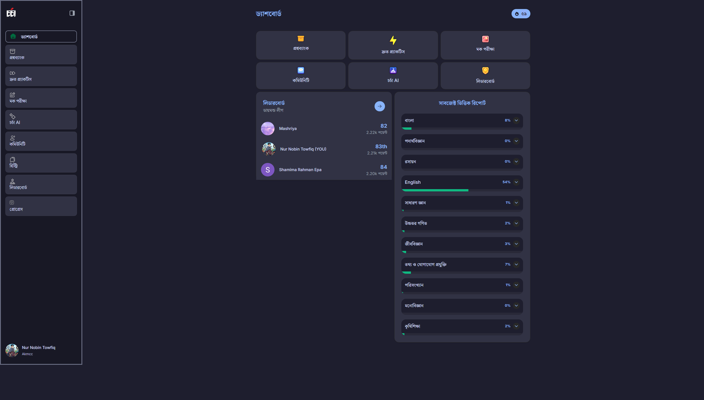   | [Install Now](chrome-extension://clngdbkpkpeebahjckkjfobafhncgmne/install-usercss.html?updateUrl=https%3A%2F%2Fraw.githubusercontent.com%2FSomrat10369%2FChorcha-Themes%2Frefs%2Fheads%2Fmain%2FCatppuccin_mocha.user.css) |
| **Cyberpunk 2077**   | 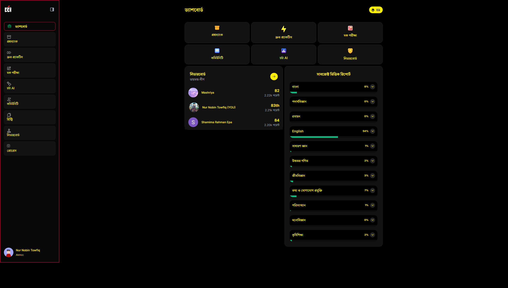      | [Install Now](chrome-extension://clngdbkpkpeebahjckkjfobafhncgmne/install-usercss.html?updateUrl=https%3A%2F%2Fraw.githubusercontent.com%2FSomrat10369%2FChorcha-Themes%2Frefs%2Fheads%2Fmain%2FCyberpunk_2077.user.css)   |
| **Dracula Pro**      | 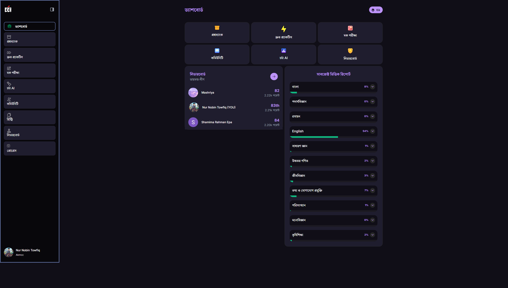       | [Install Now](chrome-extension://clngdbkpkpeebahjckkjfobafhncgmne/install-usercss.html?updateUrl=https%3A%2F%2Fraw.githubusercontent.com%2FSomrat10369%2FChorcha-Themes%2Frefs%2Fheads%2Fmain%2FDracula_Pro.user.css)      |
| **Dracula Purple**   | 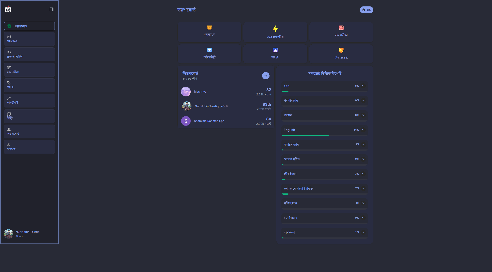 | [Install Now](chrome-extension://clngdbkpkpeebahjckkjfobafhncgmne/install-usercss.html?updateUrl=https%3A%2F%2Fraw.githubusercontent.com%2FSomrat10369%2FChorcha-Themes%2Frefs%2Fheads%2Fmain%2FDracula_purple.user.css)   |
| **Everforest**       |          | [Install Now](chrome-extension://clngdbkpkpeebahjckkjfobafhncgmne/install-usercss.html?updateUrl=https%3A%2F%2Fraw.githubusercontent.com%2FSomrat10369%2FChorcha-Themes%2Frefs%2Fheads%2Fmain%2FEverforest.user.css)       |
| **Golden Emerald**   | 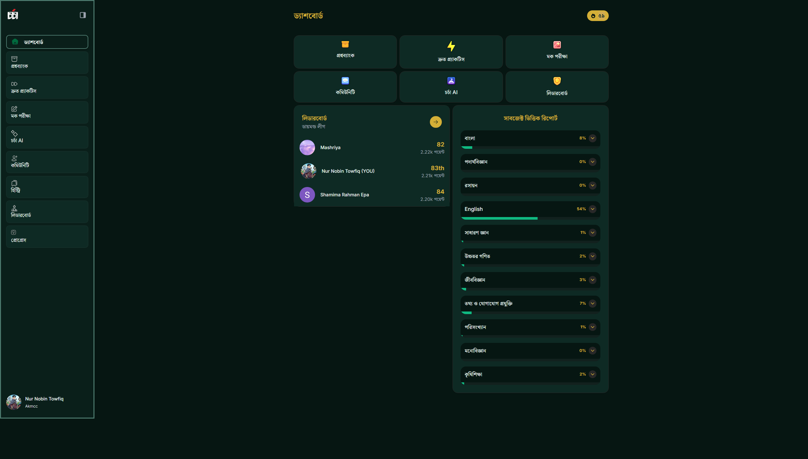 | [Install Now](chrome-extension://clngdbkpkpeebahjckkjfobafhncgmne/install-usercss.html?updateUrl=https%3A%2F%2Fraw.githubusercontent.com%2FSomrat10369%2FChorcha-Themes%2Frefs%2Fheads%2Fmain%2FGolden_emerald.user.css)   |
| **Gruvbox**          | 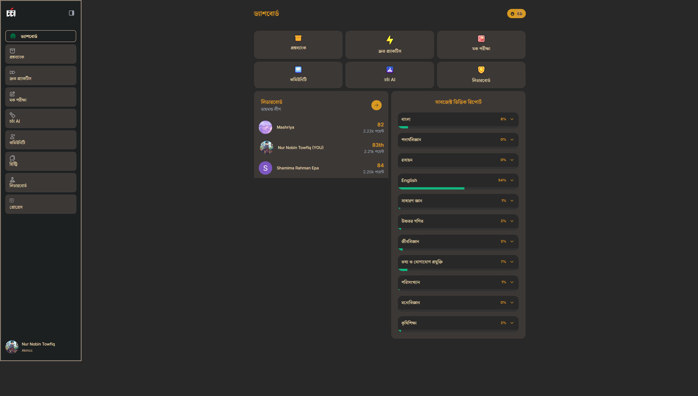               | [Install Now](chrome-extension://clngdbkpkpeebahjckkjfobafhncgmne/install-usercss.html?updateUrl=https%3A%2F%2Fraw.githubusercontent.com%2FSomrat10369%2FChorcha-Themes%2Frefs%2Fheads%2Fmain%2FGruvbox.user.css)          |
| **Minecraft End**    | 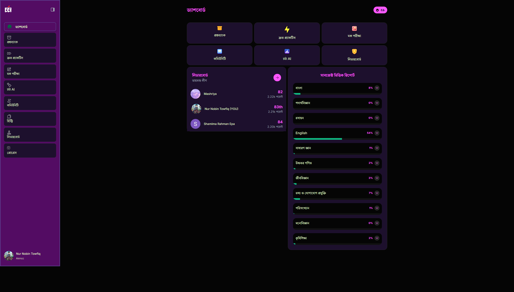       | [Install Now](chrome-extension://clngdbkpkpeebahjckkjfobafhncgmne/install-usercss.html?updateUrl=https%3A%2F%2Fraw.githubusercontent.com%2FSomrat10369%2FChorcha-Themes%2Frefs%2Fheads%2Fmain%2FMinecraft_end.user.css)    |
| **Mocha Mousse**     | 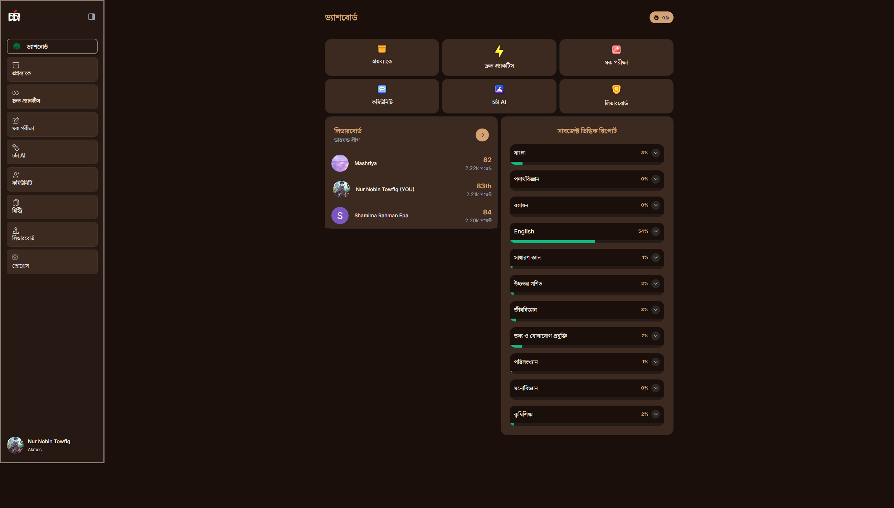            | [Install Now](chrome-extension://clngdbkpkpeebahjckkjfobafhncgmne/install-usercss.html?updateUrl=https%3A%2F%2Fraw.githubusercontent.com%2FSomrat10369%2FChorcha-Themes%2Frefs%2Fheads%2Fmain%2FMocha_mousse.user.css)     |
| **Monokai Pro**      | 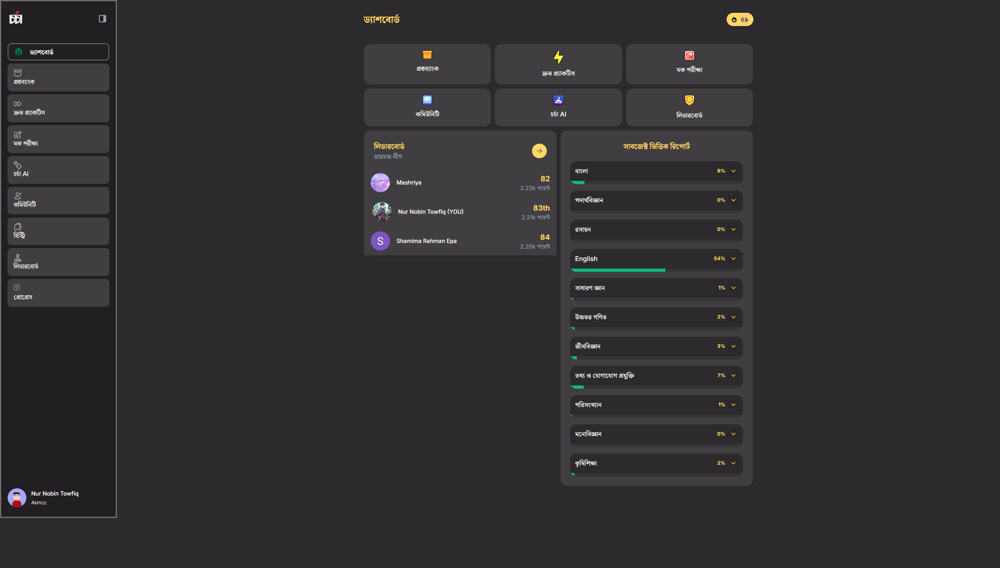           | [Install Now](chrome-extension://clngdbkpkpeebahjckkjfobafhncgmne/install-usercss.html?updateUrl=https%3A%2F%2Fraw.githubusercontent.com%2FSomrat10369%2FChorcha-Themes%2Frefs%2Fheads%2Fmain%2FMonokai_pro.user.css)      |
| **Ocean Blue**       | 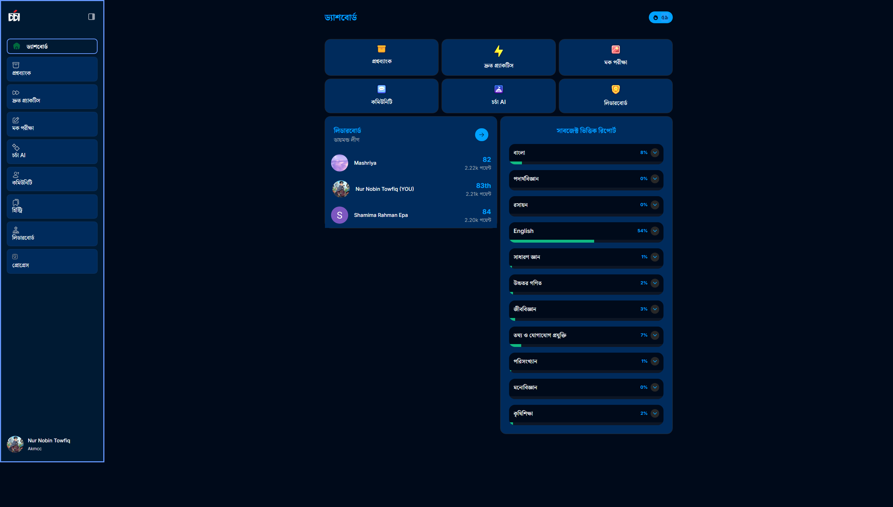              | [Install Now](chrome-extension://clngdbkpkpeebahjckkjfobafhncgmne/install-usercss.html?updateUrl=https%3A%2F%2Fraw.githubusercontent.com%2FSomrat10369%2FChorcha-Themes%2Frefs%2Fheads%2Fmain%2FOcean_blue.user.css)       |
| **Rose Pine**        | 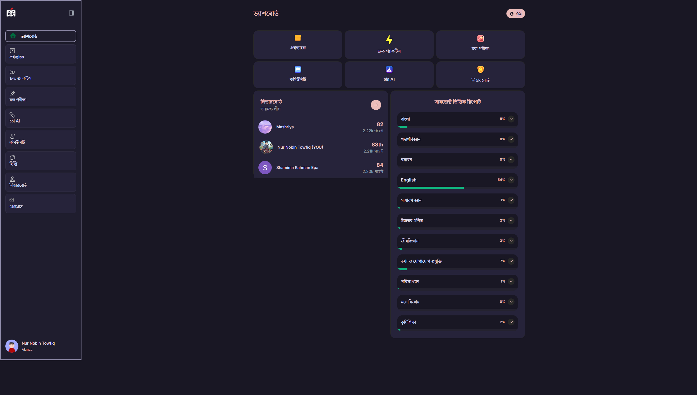           | [Install Now](chrome-extension://clngdbkpkpeebahjckkjfobafhncgmne/install-usercss.html?updateUrl=https%3A%2F%2Fraw.githubusercontent.com%2FSomrat10369%2FChorcha-Themes%2Frefs%2Fheads%2Fmain%2FRose_pine.user.css)        |
| **Synth Wave**       | 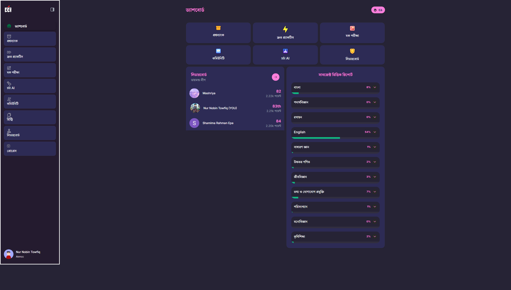          | [Install Now](chrome-extension://clngdbkpkpeebahjckkjfobafhncgmne/install-usercss.html?updateUrl=https%3A%2F%2Fraw.githubusercontent.com%2FSomrat10369%2FChorcha-Themes%2Frefs%2Fheads%2Fmain%2FSynth_wave.user.css)       |
| **Tokyo Night**      |              | [Install Now](chrome-extension://clngdbkpkpeebahjckkjfobafhncgmne/install-usercss.html?updateUrl=https%3A%2F%2Fraw.githubusercontent.com%2FSomrat10369%2FChorcha-Themes%2Frefs%2Fheads%2Fmain%2FTokyo_night.user.css)      |

---

## 🛠️ Customization

To edit any theme after installation:

1. Open the **Stylus Manager**.
2. Click the **Edit (pencil)** icon next to the theme.
3. Change the CSS variables at the top to your liking.

---

**Maintained by Somrat_10369**
